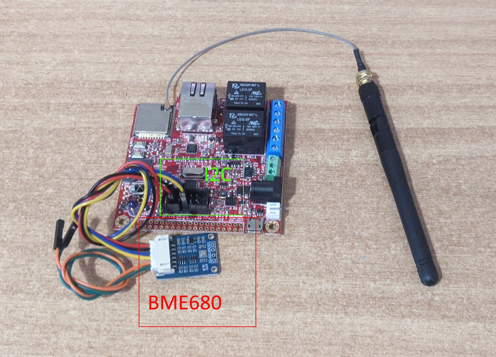
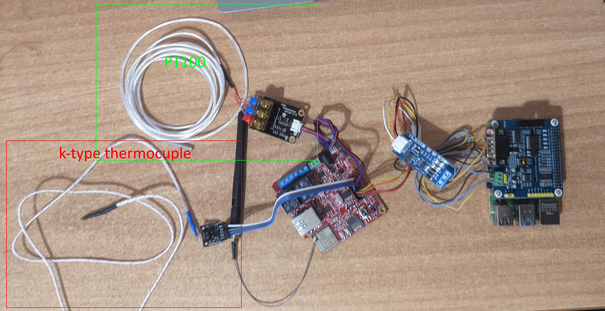

# CIRCULOOS Shopfloor Demo

The current repo is a collection of hardware and software compoment ment to simulate the jurney of the measurements of a shopfloor to a local RAMP IIoT instance (on a RasberyPi) and on the centalazed CIRCULOOS Data platform.
The demo consist of a full end to end solution ie from the sensor to the communication inside the shopfloor to the local RAMP IIoT instance and to the centalazed CIRCULOOS Data platform.

## Measurements
The following measurements (from various sensors) are included:
- Air temperature (BME680)
- Air hummidity (BME680)
- Air presure (BME680)
- Surface temperature (Pt100, k-type thermocuple)
- Inductive proximity sensor
- Weight
- Colour

## Shopfloor communication protocols 
The following communication protocols are incuded:
- CAN
- RS485 
- MQTT 
- I2C

# Sensor nodes 

The base embeded computational unit for each node is the module based on ESP32 by Olimex.

A list of the different node with each sensor can be foound on [system.md](./system.md)

## Diagram

# Demos

## sensor_node_1_scale_and_colour_over_RS485

The sensor node/ESP32  is designed to simulate a station that measures the weight and identifies the color of an item. It consists of an LCD, two buttons, a scale, and color sensors.

The user begins the procedure by pressing a button to activate the color sensor. They then position the sensor over the material to be identified. The detected color will be displayed on the LCD. Once the user finalizes the procedure, they release the button.

Next, the material (up to 5 kg) is placed on the scale. After waiting for the measurement to stabilize, the user gently presses the button.

The data is then sent via RS-485 to the Raspberry Pi. An python script reads the data from the serial and transform it on a NGSI-LD entity where it becomes available on the local CIRCULOOS data platform.

--Image placeholder --

## sensor_node_2_environmental_over_wifi

The node/ESP32 reads the external BME680 sensor via I2C every 10min, transform the measurements into a json and send it to a local MQTT Broker, running on the RasberyPi.
The json message it is read by the IoTAgent and becomes avalable to the local CIRCULOOS data platform. 

## sensor_node_3_temperature_over_can

The node/ESP32 reads the external Pt100 and a K-type thermocouple every 10min, and sends the measurements via CAN bus to the Raspberry Pi. 

An python script reads the data from the serial and transform it on a NGSI-LD entity where it becomes available on the local CIRCULOOS data platform.

 
 
 
 

Copyright © 2023-2024 European Dynamics Luxembourg S.A.

Licensed under the EUPL, Version 1.2.
You may not use this work except in compliance with the License.
You may obtain a copy of the License at https://joinup.ec.europa.eu/collection/eupl/eupl-text-eupl-12 

Unless required by applicable law or agreed to in writing, software distributed under the License is distributed on an "AS IS" BASIS,
WITHOUT WARRANTIES OR CONDITIONS OF ANY KIND, either express or implied. See the License for the specific language governing permissions and limitations under the License.